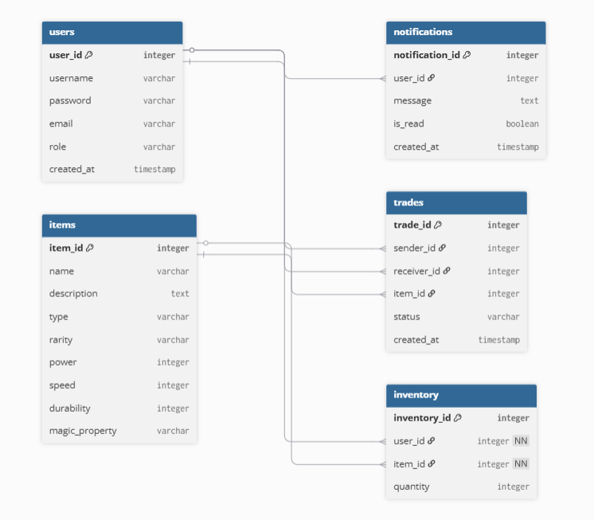
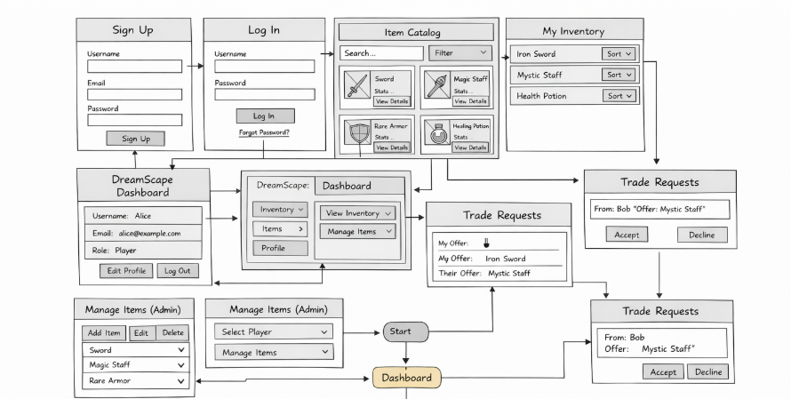

# DreamScape

DreamScape is an immersive online item-trading platform built with **Laravel 12**. Players browse a fantasy item catalog, manage their personal inventory, and send or receive trade requests. Administrators control the full item catalog and can assign items to players directly.

---

## Table of Contents

1. [Features](#features)
2. [Tech Stack](#tech-stack)
3. [Clone the Repository](#clone-the-repository)
4. [Requirements](#requirements)
5. [Setup & Installation](#setup--installation)
6. [Environment Variables](#environment-variables)
7. [Database Setup](#database-setup)
8. [Running the Application](#running-the-application)
9. [Frontend Build](#frontend-build)
10. [Running Tests](#running-tests)
11. [Roles & Test Accounts](#roles--test-accounts)
12. [Project Structure](#project-structure)
13. [MVC Overview](#mvc-overview)
    - [Models & Relationships](#models--relationships)
    - [Controllers](#controllers)
    - [Views & Layouts](#views--layouts)
14. [Routes Reference](#routes-reference)
15. [Middleware & Auth](#middleware--auth)
16. [Database Schema](#database-schema)
17. [Diagrams & Documentation](#diagrams--documentation)
18. [Common Git Commands](#common-git-commands)

---

## Features

- **Item Catalog** — Browse all fantasy items with filters by name, type, and rarity.
- **Inventory Management** — View your personal inventory with filters, sorting, and a detail page per item.
- **Trading System** — Send trade requests to other players; accept or decline incoming requests. Inventory transfers happen atomically inside a database transaction.
- **Notifications** — Automatic in-app notifications when a trade is received or accepted.
- **Admin Dashboard** — Full CRUD for items, inventory assignment to players, and a summary of platform statistics.

---

## Tech Stack

| Layer | Technology |
|---|---|
| Framework | [Laravel 12](https://laravel.com/) |
| PHP | ≥ 8.2 |
| Auth scaffold | [Laravel Breeze](https://laravel.com/docs/starter-kits#breeze) |
| RBAC | [Spatie Laravel Permission 7](https://spatie.be/docs/laravel-permission) |
| Frontend | Blade, [Tailwind CSS 3](https://tailwindcss.com/), [Alpine.js 3](https://alpinejs.dev/) |
| Build tool | [Vite 7](https://vite.dev/) |
| Default database | SQLite (MySQL also supported) |
| Queue / Cache / Session | Database driver |

---

## Clone the Repository

```bash
git clone https://github.com/Adi7142/DreamScape.git
cd DreamScape
```

---

## Requirements

- **PHP** ≥ 8.2 with standard Laravel extensions (mbstring, pdo_sqlite or pdo_mysql, openssl, bcmath, etc.)
- **Composer** ≥ 2
- **Node.js** ≥ 18 and **npm**

---

## Setup & Installation

### One-command setup

```bash
composer run setup
```

This runs the following steps automatically (`composer.json` → `scripts.setup`):

1. `composer install`
2. Copies `.env.example` → `.env` (if `.env` does not exist yet)
3. `php artisan key:generate`
4. `php artisan migrate --force`
5. `npm install`
6. `npm run build`

### Manual step-by-step

```bash
composer install
cp .env.example .env
php artisan key:generate
php artisan migrate --seed    # runs migrations and seeds all test data
npm install
npm run build
```

### Storage permissions (Linux / macOS)

```bash
chmod -R 775 storage bootstrap/cache
php artisan storage:link
```

---

## Environment Variables

Copy `.env.example` to `.env` and adjust as needed.

| Variable | Default | Notes |
|---|---|---|
| `APP_NAME` | `Laravel` | Shown in browser title and navigation |
| `APP_ENV` | `local` | Set to `production` when deploying |
| `APP_KEY` | *(empty)* | Generated by `php artisan key:generate` |
| `APP_DEBUG` | `true` | Set to `false` in production |
| `APP_URL` | `http://localhost` | Your public URL |
| `DB_CONNECTION` | `sqlite` | Switch to `mysql` for MySQL |
| `DB_HOST` | `127.0.0.1` | MySQL only |
| `DB_PORT` | `3306` | MySQL only |
| `DB_DATABASE` | *(sqlite file)* | Path for SQLite or database name for MySQL |
| `DB_USERNAME` | `root` | MySQL only |
| `DB_PASSWORD` | *(empty)* | MySQL only |
| `SESSION_DRIVER` | `database` | |
| `QUEUE_CONNECTION` | `database` | |
| `CACHE_STORE` | `database` | |
| `MAIL_MAILER` | `log` | Emails are written to the log in development |

---

## Database Setup

```bash
# Run all migrations
php artisan migrate

# Seed roles, users, items, and inventory
php artisan db:seed

# Or both at once
php artisan migrate --seed

# Reset and re-seed (destructive)
php artisan migrate:fresh --seed
```

Seeder execution order (`database/seeders/DatabaseSeeder.php`):

1. `RoleSeeder` — creates roles `beheerder` and `speler`
2. `UserSeeder` — creates 1 admin and 4 player accounts
3. `ItemSeeder` — creates 7 fantasy items
4. `InventorySeeder` — assigns items to the player accounts

---

## Running the Application

### All-in-one dev server

```bash
composer run dev
```

Starts four processes concurrently via `concurrently`:

| Process | Command |
|---|---|
| Web server | `php artisan serve` |
| Queue worker | `php artisan queue:listen --tries=1 --timeout=0` |
| Log viewer | `php artisan pail --timeout=0` |
| Vite HMR | `npm run dev` |

The application is then available at <http://localhost:8000>.

### Queue worker (standalone)

```bash
php artisan queue:work
```

The queue connection is `database` by default; no Redis or other broker is required.

---

## Frontend Build

```bash
npm run dev      # development server with Hot Module Replacement
npm run build    # production build (output to public/build/)
```

Entry points (`vite.config.js`): `resources/css/app.css`, `resources/js/app.js`

---

## Running Tests

```bash
composer run test
# Equivalent to:
php artisan config:clear
php artisan test
```

Test files live in `tests/`. The test suite uses **PHPUnit 11**.

---

## Roles & Test Accounts

Two roles exist (Dutch names enforced via Spatie, `database/seeders/RoleSeeder.php`):

| Role | Dutch name | Access |
|---|---|---|
| Administrator | `beheerder` | Full platform access including `/admin` |
| Player | `speler` | Items, inventory, trades, notifications, profile |

### Seeded accounts

| Email | Name | Role | Password |
|---|---|---|---|
| admin@example.com | AdminMaster | beheerder | Admin007 |
| shadow@example.com | ShadowSlayer | speler | Test123! |
| mystic@example.com | MysticMage | speler | Mage2024 |
| dragon@example.com | DragonKnight | speler | Dragon!99 |
| thunder@example.com | ThunderRogue | speler | Thund3r!! |

---

## Project Structure

```
DreamScape/
├── app/
│   ├── Http/
│   │   ├── Controllers/
│   │   │   ├── Admin/          # AdminController, AdminItemController, AdminInventoryController
│   │   │   ├── Auth/           # Breeze auth controllers
│   │   │   ├── InventoryController.php
│   │   │   ├── ItemController.php
│   │   │   ├── NotificationController.php
│   │   │   ├── ProfileController.php
│   │   │   └── TradeController.php
│   │   └── Requests/           # Form request validation
│   ├── Models/
│   │   ├── Inventory.php
│   │   ├── Item.php
│   │   ├── Notification.php
│   │   ├── Trade.php
│   │   └── User.php
│   └── Providers/
├── bootstrap/
│   └── app.php                 # Middleware aliases (role, permission, role_or_permission)
├── config/
├── database/
│   ├── migrations/             # All table definitions
│   └── seeders/                # RoleSeeder, UserSeeder, ItemSeeder, InventorySeeder
├── public/                     # Web root
├── resources/
│   ├── css/app.css
│   ├── js/app.js
│   └── views/
│       ├── admin/              # Admin dashboard, items CRUD, inventory assign
│       ├── auth/               # Breeze auth views
│       ├── components/         # Reusable Blade components
│       ├── inventory/
│       ├── items/
│       ├── layouts/            # app.blade.php, guest.blade.php, navigation.blade.php
│       ├── notifications/
│       ├── profile/
│       ├── trades/
│       ├── dashboard.blade.php
│       └── welcome.blade.php
├── routes/
│   ├── auth.php                # Breeze auth routes
│   └── web.php                 # All application routes
├── tests/
├── .env.example
├── composer.json
├── package.json
├── tailwind.config.js
└── vite.config.js
```

---

## MVC Overview

### Models & Relationships

| Model | Table | Key Relationships |
|---|---|---|
| `User` | `users` | `hasMany` Inventory, Trade (sender & receiver), Notification; uses Spatie `HasRoles` |
| `Item` | `items` | `hasMany` Inventory, Trade |
| `Inventory` | `inventory` *(singular — set explicitly in model)* | `belongsTo` User, Item |
| `Trade` | `trades` | `belongsTo` User (sender), User (receiver), Item |
| `Notification` | `notifications` | `belongsTo` User |

### Controllers

| Controller | Namespace | Models Used | Responsibility |
|---|---|---|---|
| `ItemController` | `App\Http\Controllers` | `Item` | Browse item catalog (search, type, rarity filters) |
| `InventoryController` | `App\Http\Controllers` | `Inventory`, `Item` | View own inventory with filters & sort; item detail |
| `TradeController` | `App\Http\Controllers` | `Trade`, `User`, `Inventory`, `Notification` | Create/list trades; accept (DB transaction) / decline |
| `NotificationController` | `App\Http\Controllers` | `Notification` | List notifications; mark as read |
| `ProfileController` | `App\Http\Controllers` | `User` | Edit / update / delete own account |
| `AdminController` | `App\Http\Controllers\Admin` | `User`, `Item`, `Trade` | Admin dashboard with platform statistics |
| `AdminItemController` | `App\Http\Controllers\Admin` | `Item` | Full CRUD for items |
| `AdminInventoryController` | `App\Http\Controllers\Admin` | `Inventory`, `Item`, `User` | Assign items to players |

### Views & Layouts

**Layouts** (`resources/views/layouts/`):

| Layout | Description |
|---|---|
| `app.blade.php` | Main authenticated shell — includes Vite assets, navigation, `$header` and `$slot` |
| `guest.blade.php` | Unauthenticated shell for login/register pages |
| `navigation.blade.php` | Top navigation bar, included by `app` layout |

**Blade components** (`resources/views/components/`): `application-logo`, `auth-session-status`, `danger-button`, `dropdown`, `dropdown-link`, `input-error`, `input-label`, `modal`, `nav-link`, `primary-button`, `responsive-nav-link`, `secondary-button`, `text-input`

---

## Routes Reference

### Public

| Method | URI | Action |
|---|---|---|
| GET | `/` | `welcome` view |

### Authenticated players (`auth` + `verified`)

| Method | URI | Controller@Method |
|---|---|---|
| GET | `/dashboard` | `dashboard` view |
| GET | `/profile` | `ProfileController@edit` |
| PATCH | `/profile` | `ProfileController@update` |
| DELETE | `/profile` | `ProfileController@destroy` |
| GET | `/items` | `ItemController@index` |
| GET | `/items/{item}` | `ItemController@show` |
| GET | `/inventory` | `InventoryController@index` |
| GET | `/inventory/{inventory}` | `InventoryController@show` |
| GET | `/trades` | `TradeController@index` |
| GET | `/trades/create` | `TradeController@create` |
| POST | `/trades` | `TradeController@store` |
| PATCH | `/trades/{trade}/accept` | `TradeController@accept` |
| PATCH | `/trades/{trade}/decline` | `TradeController@decline` |
| GET | `/notifications` | `NotificationController@index` |
| PATCH | `/notifications/{notification}/read` | `NotificationController@markAsRead` |

### Admin only (`auth` + `verified` + `role:beheerder`, prefix `/admin`)

| Method | URI | Controller@Method |
|---|---|---|
| GET | `/admin` | `AdminController@index` |
| GET | `/admin/items` | `AdminItemController@index` |
| GET | `/admin/items/create` | `AdminItemController@create` |
| POST | `/admin/items` | `AdminItemController@store` |
| GET | `/admin/items/{item}/edit` | `AdminItemController@edit` |
| PATCH | `/admin/items/{item}` | `AdminItemController@update` |
| DELETE | `/admin/items/{item}` | `AdminItemController@destroy` |
| GET | `/admin/inventory/assign` | `AdminInventoryController@create` |
| POST | `/admin/inventory/assign` | `AdminInventoryController@store` |

### Auth routes (`routes/auth.php` — provided by Breeze)

`/register`, `/login`, `/logout`, `/forgot-password`, `/reset-password`, `/verify-email`, `/confirm-password`, `/password`

---

## Middleware & Auth

Middleware aliases are registered in `bootstrap/app.php`:

| Alias | Class |
|---|---|
| `role` | `Spatie\Permission\Middleware\RoleMiddleware` |
| `permission` | `Spatie\Permission\Middleware\PermissionMiddleware` |
| `role_or_permission` | `Spatie\Permission\Middleware\RoleOrPermissionMiddleware` |

The admin section uses `role:beheerder`. Unauthenticated users are redirected to `/login` by the `auth` middleware. Email verification is enforced by the `verified` middleware.

---

## Database Schema

### `users`
| Column | Type | Notes |
|---|---|---|
| `id` | bigint PK | |
| `name` | string | |
| `email` | string | unique |
| `email_verified_at` | timestamp | nullable |
| `password` | string | bcrypt hashed |
| `remember_token` | string | nullable |
| `created_at` / `updated_at` | timestamp | |

### `items`
| Column | Type | Notes |
|---|---|---|
| `id` | bigint PK | |
| `name` | string | |
| `description` | text | |
| `type` | string | e.g. Wapen, Armor, Accessoire |
| `rarity` | string | e.g. Legendarisch, Episch, Zeldzaam |
| `power` | integer | 0–100, default 0 |
| `speed` | integer | 0–100, default 0 |
| `durability` | integer | 0–100, default 0 |
| `magic_property` | string | nullable |
| `created_at` / `updated_at` | timestamp | |

### `inventory` *(table name is singular)*
| Column | Type | Notes |
|---|---|---|
| `id` | bigint PK | |
| `user_id` | FK → users | cascade on delete |
| `item_id` | FK → items | cascade on delete |
| `quantity` | integer | default 1 |
| `created_at` / `updated_at` | timestamp | |

### `trades`
| Column | Type | Notes |
|---|---|---|
| `id` | bigint PK | |
| `sender_id` | FK → users | cascade on delete |
| `receiver_id` | FK → users | cascade on delete |
| `item_id` | FK → items | cascade on delete |
| `status` | string | `pending` \| `accepted` \| `declined` |
| `created_at` / `updated_at` | timestamp | |

### `notifications`
| Column | Type | Notes |
|---|---|---|
| `id` | bigint PK | |
| `user_id` | FK → users | cascade on delete |
| `message` | text | |
| `is_read` | boolean | default false |
| `created_at` / `updated_at` | timestamp | |

Additional standard Laravel tables: `sessions`, `cache`, `cache_locks`, `jobs`, `job_batches`, `failed_jobs`, `password_reset_tokens`, and Spatie permission tables (`roles`, `permissions`, `model_has_roles`, `model_has_permissions`, `role_has_permissions`).

---

## Diagrams & Documentation

The following artefacts are stored in the repository root:

| File | Description |
|---|---|
| `ERD_DreamScape.png` | Entity-Relationship Diagram |
| `ActiviteitendiagramDeel1.png` | Activity Diagram — Part 1 |
| `Activiteitendiagram2.png` | Activity Diagram — Part 2 |
| `WireframeDreamScape.png` | UI Wireframes |
| `DreamScape Acceptatietest E4.docx` | Acceptance test plan |
| `DreamScape Testrapport.docx` | Test report |
| `DreamScape Verslag over haalbaarheid, privacy en security.docx` | Feasibility, privacy & security report |
| `user stories DreamScape.docx` | User stories |

### ERD



### Wireframes



---

## Common Git Commands

```bash
# Clone the repository
git clone https://github.com/Adi7142/DreamScape.git
cd DreamScape

# Check status and recent changes
git status
git log --oneline -10

# Create a feature branch
git checkout -b feature/my-feature

# Stage, commit and push
git add .
git commit -m "feat: describe your change"
git push origin feature/my-feature

# Pull latest changes from main
git pull origin main

# Merge main into your branch
git fetch origin main
git merge origin/main
```